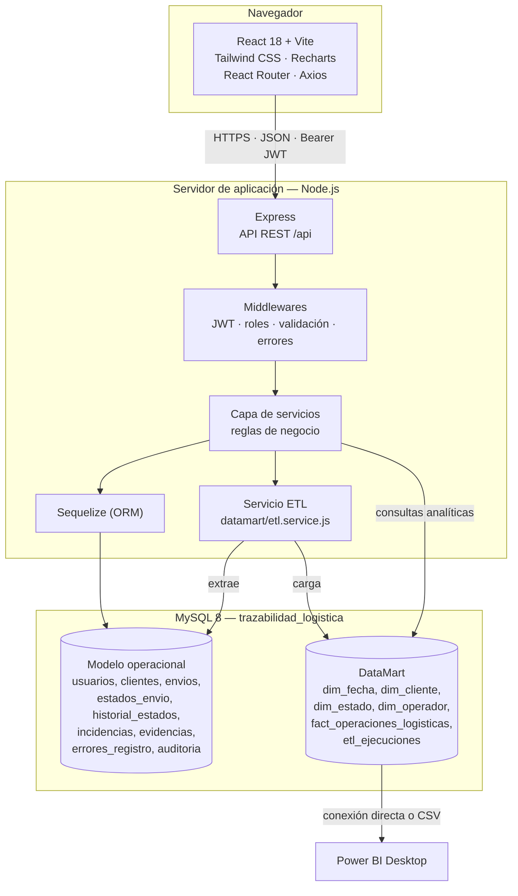
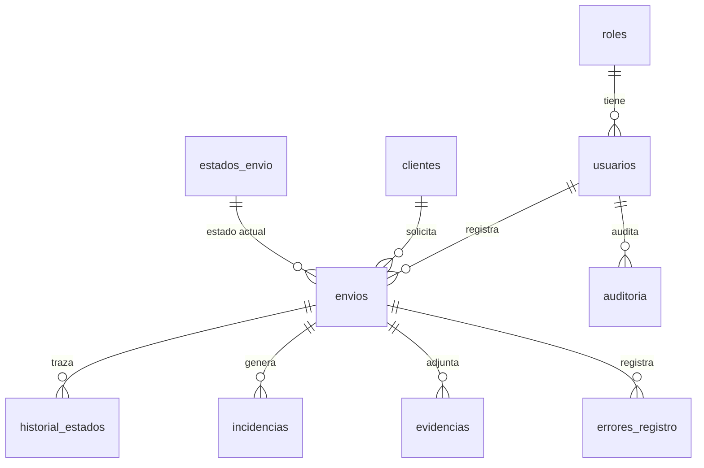

# Arquitectura del sistema

Aplicación web de trazabilidad logística con DataMart — Grupo Logístico Salazar S.A.C., Lima 2026.

## 1. Visión general

Arquitectura cliente-servidor de tres capas, con **dos modelos lógicos** (operacional y dimensional)
en una **única base de datos física** MySQL `trazabilidad_logistica`.



Scrum cubre el desarrollo funcional de la aplicación web. Kimball cubre el DataMart.
La integración funcional es H.U.18 (Sprint 5). Ver [SCRUM.md](./SCRUM.md) y [KIMBALL.md](./KIMBALL.md).

---

## 2. Frontend

| Aspecto | Implementación |
|---|---|
| Framework | React 18 con Vite |
| Estilos | Tailwind CSS |
| Gráficos | Recharts |
| Enrutado | React Router (`src/routes/AppRoutes.jsx`) |
| Estado de sesión | `AuthContext` con JWT en almacenamiento local |
| Cliente HTTP | Axios con interceptor de token (`src/services/api.js`) |
| Identidad visual | Logos oficiales (`BrandLogo`) y paleta institucional (rojo ladrillo / grafito) |
| Alcance de registros | Filtro «todos / solo mis registros» en envíos, seguimiento e incidencias |

Protección de rutas: `PrivateRoute` exige sesión y `AdminRoute` exige rol Administrador.
La ruta de producto reservada al Administrador es `/datamart` (análisis de operaciones).
El modo demostración (`VITE_DEMO_MODE`) permanece en el código por compatibilidad local y **está desactivado** en el entorno de uso.

### Páginas de la solución tecnológica

| Ruta | Pantalla | Rol |
|---|---|---|
| `/dashboard` | Indicadores operativos y accesos | Autenticado |
| `/envios`, `/envios/nuevo`, `/envios/:id/editar` | Gestión de envíos | Autenticado |
| `/clientes` | Gestión de clientes | Autenticado |
| `/seguimiento`, `/seguimiento/:id` | Trazabilidad y cambios de estado | Autenticado |
| `/incidencias` | Registro de incidencias operativas | Autenticado |
| `/reportes` | Reportes operativos y exportaciones | Autenticado |
| `/datamart` | Análisis de operaciones, ETL y KPIs analíticos | **Administrador** |

---

## 3. Backend

Estructura por capas en `backend/src`:

```
src/
├── app.js                  Configuración de Express
├── server.js               Arranque y conexión a MySQL
├── config/                 database.js, jwt.js
├── middlewares/            auth, validate, upload, error
├── routes/                 Definición de endpoints y validadores
├── controllers/            Adaptación HTTP ↔ servicios
├── services/               Reglas de negocio
├── repositories/           Consultas complejas reutilizables
├── models/                 Modelos y asociaciones Sequelize
├── utils/                  reglasIndicadores, códigos, sanitize, response
└── datamart/               etl.service.js, star-schema.design.js
```

Flujo de una petición: `ruta → validador → autenticación → autorización → controlador → servicio → modelo/SQL → respuesta normalizada`.

### Seguridad

- **Autenticación:** JWT firmado (`JWT_SECRET`), verificado en `authenticate`. Se recarga el usuario
  en cada petición y se rechaza si está inactivo.
- **Autorización:** middleware `authorize('Administrador')` sobre las rutas sensibles.
- **Roles:** Administrador y Operador logístico.
- **Contraseñas:** hash bcrypt.
- **Validación de entrada:** `express-validator`; los fallos de validación se persisten en
  `errores_registro`.
- **Auditoría:** tabla `auditoria` con `datos_anteriores` / `datos_nuevos` en JSON.

---

## 4. API REST

Prefijo común `/api`. Respuesta normalizada `{ success, message, data }`.

| Grupo | Rutas | Notas |
|---|---|---|
| `/auth` | login, perfil | Emite y valida el JWT |
| `/dashboard` | KPIs operativos | |
| `/envios` | CRUD, cambio de estado, historial | Captura de tiempos de registro |
| `/incidencias` | CRUD | Registro operativo de incidencias |
| `/evidencias` | Carga de archivos | `multer` |
| `/reportes` | Generación y exportación | |
| `/catalogos` | Clientes, estados, roles | |
| `/usuarios` | CRUD de cuentas | Solo Administrador |
| `/datamart` | design, preview, analytics, etl/run, etl/ejecuciones | Administración del componente analítico |

---

## 5. Base de datos

Una sola base de datos: **`trazabilidad_logistica`**, `utf8mb4` / `utf8mb4_unicode_ci`.

### Modelo operacional (OLTP)



Columnas de control técnico en `envios` e `incidencias`: `origen_dato` (`REAL` \| `SINTETICO`) y
`grupo_muestra`. Permiten aislar datos sintéticos de prueba del DataMart.

### Modelo dimensional (DataMart)

Esquema estrella descrito en [KIMBALL.md](./KIMBALL.md).

---

## 6. Flujo de la información

```mermaid
sequenceDiagram
    participant O as Operador logístico
    participant FE as Frontend React
    participant API as API Express
    participant DB as MySQL (OLTP)
    participant ETL as Servicio ETL
    participant DM as DataMart
    participant BI as Power BI

    O->>FE: Abre el formulario de envío
    FE->>FE: Marca hora_inicio_registro
    O->>FE: Completa y guarda
    FE->>API: POST /api/envios (Bearer JWT)
    API->>API: Valida; los fallos van a errores_registro
    API->>DB: INSERT envio + tiempo_registro_min
    API->>DB: INSERT historial_estados (hito inicial)
    API-->>FE: 201 Created

    O->>API: POST /api/incidencias
    API->>DB: INSERT incidencia

    Note over API,DM: Análisis de operaciones (Administrador)
    API->>ETL: POST /api/datamart/etl/run
    ETL->>DB: Extrae operaciones
    ETL->>DM: Carga dimensiones y hechos (idempotente)
    ETL->>DM: Registra la corrida en etl_ejecuciones
    BI->>DM: Consulta el esquema estrella
```

---

## 7. Despliegue

| Componente | Entorno local | Entorno cloud de referencia |
|---|---|---|
| Base de datos | MySQL 8 local | Railway (MySQL) |
| Backend | `npm run dev` (nodemon) | Render |
| Frontend | `npm run dev` (Vite) | Vercel |
| BI | Power BI Desktop sobre MySQL o CSV | — |

Variables de entorno del backend en `backend/.env` (`DB_*`, `JWT_SECRET`, `PORT`) y del frontend en
`frontend/.env` (`VITE_API_URL`). Detalle operativo en `DEPLOY.md`.
