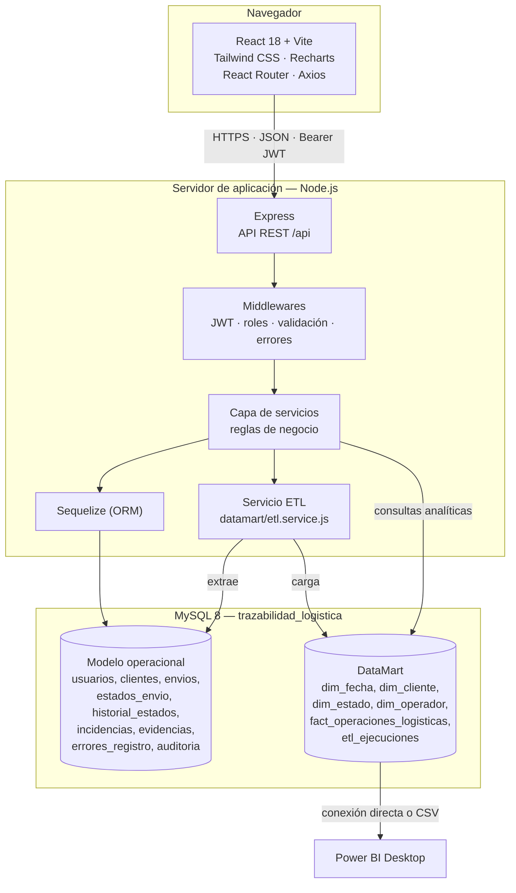
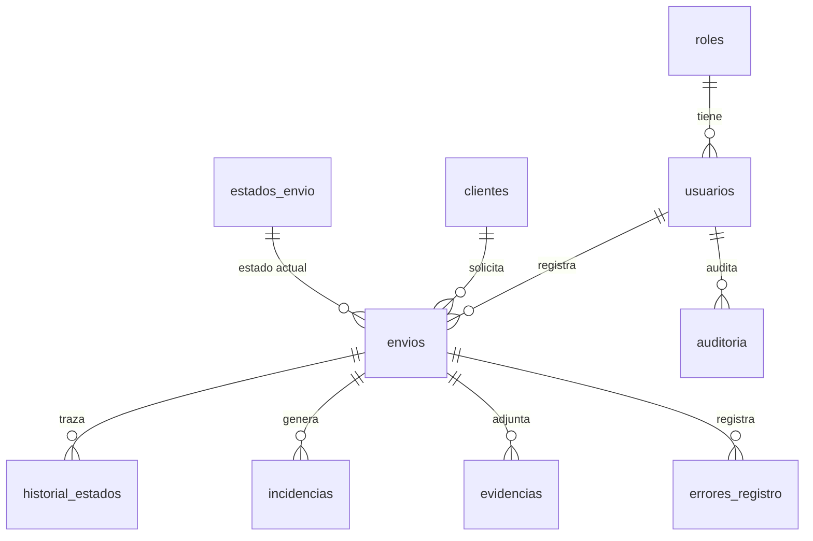

# Arquitectura del sistema

Aplicación web de trazabilidad logística con DataMart — Grupo Logístico Salazar S.A.C., Lima 2026.

## 1. Visión general

Arquitectura cliente-servidor de tres capas, con una única base de datos MySQL que aloja tanto el
modelo transaccional (OLTP) como el modelo dimensional del DataMart en esquemas lógicos separados
por convención de nombres (`dim_*`, `fact_*`).



## 2. Frontend

| Aspecto | Implementación |
|---|---|
| Framework | React 18 con Vite |
| Estilos | Tailwind CSS |
| Gráficos | Recharts |
| Enrutado | React Router (`src/routes/AppRoutes.jsx`) |
| Estado de sesión | `AuthContext` con JWT en almacenamiento local |
| Cliente HTTP | Axios con interceptor de token (`src/services/api.js`) |
| Modo demostración | `VITE_DEMO_MODE=true` intercepta las llamadas y responde con `src/services/mockData.js` |

Protección de rutas: `PrivateRoute` exige sesión y `AdminRoute` exige rol Administrador. Son rutas
solo para Administrador `/medicion` y `/datamart`.

### Páginas

| Ruta | Pantalla | Rol |
|---|---|---|
| `/dashboard` | Indicadores operativos y accesos | Autenticado |
| `/envios`, `/envios/nuevo`, `/envios/:id/editar` | Gestión de envíos | Autenticado |
| `/clientes` | Gestión de clientes | Autenticado |
| `/seguimiento`, `/seguimiento/:id` | Trazabilidad y cambios de estado | Autenticado |
| `/incidencias` | Registro de incidencias operativas | Autenticado |
| `/reportes` | Reportes operativos y exportaciones | Autenticado |
| `/observacion` | Fichas de observación por dimensión | Autenticado |
| `/medicion` | Medición de investigación (preprueba/posprueba) | **Administrador** |
| `/datamart` | DataMart, ETL y KPIs analíticos | **Administrador** |

## 3. Backend

Estructura por capas en `backend/src`:

```
src/
├── app.js                  Configuración de Express
├── server.js               Arranque y conexión a MySQL
├── config/                 database.js, jwt.js
├── middlewares/            auth, validate, upload, error
├── routes/                 Definición de endpoints y validadores
├── controllers/            Adaptación HTTP ↔ servicios
├── services/               Reglas de negocio
├── repositories/           Consultas complejas reutilizables
├── models/                 Modelos y asociaciones Sequelize
├── utils/                  reglasIndicadores, códigos, sanitize, response
└── datamart/               etl.service.js, star-schema.design.js
```

Flujo de una petición: `ruta → validador → autenticación → autorización → controlador → servicio → modelo/SQL → respuesta normalizada`.

### Seguridad

- **Autenticación:** JWT firmado (`JWT_SECRET`), verificado en `authenticate`. Se recarga el usuario
  en cada petición y se rechaza si está inactivo.
- **Autorización:** middleware `authorize('Administrador')` sobre las rutas sensibles.
- **Roles:** Administrador y Operador logístico.
- **Contraseñas:** hash bcrypt.
- **Validación de entrada:** `express-validator`; los fallos de validación se persisten en
  `errores_registro`, insumo del indicador PER.
- **Auditoría:** tabla `auditoria` con `datos_anteriores` / `datos_nuevos` en JSON.

## 4. API REST

Prefijo común `/api`. Respuesta normalizada `{ success, message, data }`.

| Grupo | Rutas | Notas |
|---|---|---|
| `/auth` | login, perfil | Emite y valida el JWT |
| `/dashboard` | KPIs operativos | |
| `/envios` | CRUD, cambio de estado, historial | Captura de tiempos de registro (TPRE) |
| `/incidencias` | CRUD | Evalúa "información completa" (PIOIC) al guardar |
| `/evidencias` | Carga de archivos | `multer` |
| `/reportes` | Generación y exportación | |
| `/catalogos` | Clientes, estados, usuarios | |
| `/observacion` | Indicadores, medición, fichas 1-4 y exportación | `/medicion` solo Administrador |
| `/datamart` | design, preview, analytics, etl/run, etl/ejecuciones | Todo solo Administrador salvo `design` |

## 5. Base de datos

Una sola base de datos: **`trazabilidad_logistica`**, con juego de caracteres `utf8mb4` y
colación `utf8mb4_unicode_ci`.

### Modelo operacional (OLTP)



Columnas de control de la investigación en `envios` e `incidencias`: `origen_dato`
(`REAL` \| `SINTETICO`) y `grupo_muestra` (`PREPRUEBA` \| `POSPRUEBA` \| `NO_MUESTRA`).

### Modelo dimensional (DataMart)

Esquema estrella descrito en detalle en [KIMBALL.md](./KIMBALL.md).

### Vistas de apoyo

`vw_ficha_eficiencia`, `vw_ficha_calidad`, `vw_ficha_control`, `vw_ficha_informacion_operativa` y
`vw_ficha_reportes` exponen las fichas de observación con las columnas `origen_dato` y
`grupo_muestra`, para consulta directa desde MySQL Workbench o Power BI. La API no depende de ellas:
`observacion.service.js` construye su propio SQL parametrizado, de modo que una base sin vistas sigue
funcionando.

## 6. Flujo de la información

```mermaid
sequenceDiagram
    participant O as Operador logístico
    participant FE as Frontend React
    participant API as API Express
    participant DB as MySQL (OLTP)
    participant ETL as Servicio ETL
    participant DM as DataMart
    participant BI as Power BI

    O->>FE: Abre el formulario de envío
    FE->>FE: Marca hora_inicio_registro
    O->>FE: Completa y guarda
    FE->>API: POST /api/envios (Bearer JWT)
    API->>API: Valida; los fallos van a errores_registro (PER)
    API->>DB: INSERT envio + tiempo_registro_min (TPRE)
    API->>DB: INSERT historial_estados (PEEA)
    API-->>FE: 201 Created

    O->>API: POST /api/incidencias
    API->>API: Evalúa esIncidenciaCompleta() (PIOIC)
    API->>DB: INSERT incidencia

    Note over API,DM: Proceso analítico (Administrador)
    API->>ETL: POST /api/datamart/etl/run
    ETL->>DB: Extrae operaciones
    ETL->>DM: Carga dimensiones y hechos (idempotente)
    ETL->>DM: Registra la corrida en etl_ejecuciones
    BI->>DM: Consulta el esquema estrella
```

## 7. Despliegue

| Componente | Entorno local | Entorno cloud de referencia |
|---|---|---|
| Base de datos | MySQL 8 local | Railway (MySQL) |
| Backend | `npm run dev` (nodemon) | Render |
| Frontend | `npm run dev` (Vite) | Vercel |
| BI | Power BI Desktop sobre MySQL local o CSV exportado | — |

Variables de entorno del backend en `backend/.env` (`DB_*`, `JWT_SECRET`, `PORT`) y del frontend en
`frontend/.env` (`VITE_API_URL`, `VITE_DEMO_MODE`). Detalle operativo en `DEPLOY.md`.

> **[PENDIENTE DE CONFIRMAR]** El entorno cloud descrito quedó fuera de servicio al expirar el
> período de prueba de Railway. El estado vigente del despliegue debe confirmarse antes de la
> sustentación.
