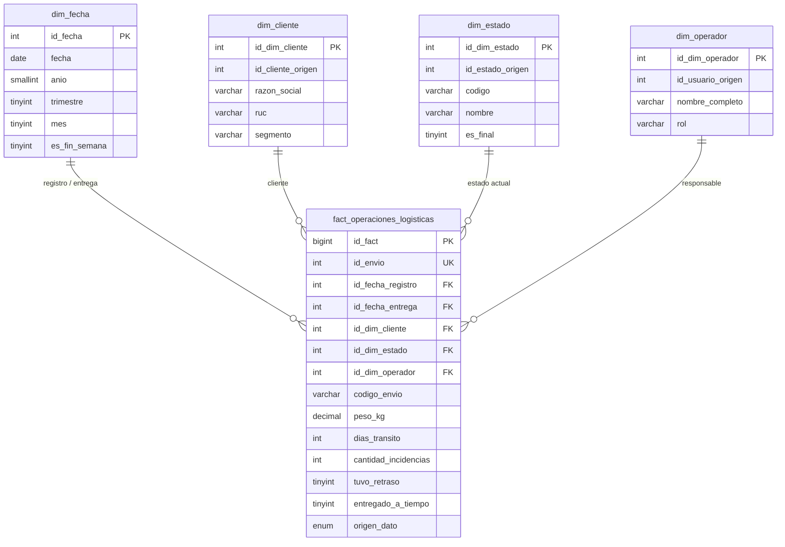

# DataMart — Diseño dimensional (metodología Kimball)

Este documento describe **lo que está implementado físicamente** en MySQL, verificado contra
`backend/database/scripts/01_schema_completo.sql`, `07_muestra_investigacion.sql` y
`backend/src/datamart/etl.service.js`. No describe funcionalidad prevista.

---

## 1. Selección del proceso de negocio

**Proceso:** gestión de operaciones logísticas de envíos.

Abarca el ciclo desde el registro del envío en la aplicación, sus cambios de estado, las
incidencias asociadas y la entrega. Es el proceso que la empresa ejecuta de forma repetitiva y
sobre el que existen métricas de desempeño medibles.

## 2. Requerimientos analíticos atendidos

| Requerimiento | Métrica que lo soporta | Implementado en |
|---|---|---|
| Cumplimiento de entregas a tiempo (OTIF) | `entregado_a_tiempo` | `GET /api/datamart/analytics` |
| Duración del ciclo de entrega | `dias_transito` | `GET /api/datamart/analytics` |
| Carga de incidencias por volumen operado | `cantidad_incidencias` | `GET /api/datamart/analytics` |
| Envíos afectados por retraso | `tuvo_retraso` | `GET /api/datamart/analytics` |
| Volumen físico transportado | `peso_kg` | `GET /api/datamart/analytics` |
| Análisis por cliente, estado, operador y fecha | claves de dimensión | Power BI sobre el esquema estrella |

## 3. Declaración del grano

> **Una fila de la tabla de hechos `fact_operaciones_logisticas` representa una operación de envío.**

- El ETL inserta como máximo una fila por `id_envio` (`NOT EXISTS` sobre la tabla de hechos) y la
  migración 07 añade `UNIQUE KEY uk_fact_envio (id_envio)` para garantizarlo a nivel de motor.
- Las reejecuciones **actualizan** las métricas de la fila existente en lugar de crear una nueva.
- **No existen snapshots periódicos.** La expresión "snapshot" no se usa para describir esta tabla,
  porque físicamente no hay una foto por período: hay una fila viva por envío.
- Como no hay múltiples filas por envío, no existe riesgo de duplicar métricas al agregar.

## 4. Dimensiones

| Dimensión | Clave subrogada | Clave natural | Tipo SCD **realmente implementado** | Atributos |
|---|---|---|---|---|
| `dim_fecha` | `id_fecha` (AAAAMMDD) | `fecha` | **Tipo 0** (estática, precargada 2024-2027) | `anio`, `trimestre`, `mes`, `nombre_mes`, `dia`, `dia_semana`, `nombre_dia`, `es_fin_semana`, `semana_anio` |
| `dim_cliente` | `id_dim_cliente` | `id_cliente_origen` | **Tipo 1** (sobrescritura) | `razon_social`, `ruc`, `ciudad`, `distrito`, `segmento` |
| `dim_estado` | `id_dim_estado` | `id_estado_origen` | **Tipo 1** (sobrescritura) | `codigo`, `nombre`, `es_final`, `categoria` |
| `dim_operador` | `id_dim_operador` | `id_usuario_origen` | **Tipo 1** (sobrescritura) | `nombre_completo`, `rol` |

`dim_fecha` cumple además el papel de dimensión *role-playing*: la tabla de hechos la referencia dos
veces, como fecha de registro (`id_fecha_registro`) y como fecha de entrega (`id_fecha_entrega`).

### Corrección respecto a la documentación previa

El archivo `star-schema.design.js` declaraba `dim_cliente`, `dim_estado` y `dim_operador` como
**SCD Tipo 2**. La auditoría comprobó que **eso no era cierto**:

- Las columnas `vigente_desde`, `vigente_hasta` y `es_actual` existen físicamente, pero
- el ETL nunca cierra una versión (`vigente_hasta` permanece `NULL` y `es_actual` siempre en `1`), y
- nunca inserta una segunda fila para la misma clave natural.

Por tanto **no hay historial** y no puede documentarse como Tipo 2. Tras la auditoría el ETL
sobrescribe explícitamente los atributos descriptivos, que es el comportamiento **Tipo 1**, y la
documentación se corrigió en consecuencia.

**Decisión: no se implementa SCD Tipo 2.** No existe hoy un requerimiento analítico que exija
reconstruir el estado histórico de un cliente o de un operador; implementarlo solo para poder
declararlo sería sobreingeniería. Las columnas se conservan porque el esquema ya está desplegado y
habilitan una migración futura si aparece esa necesidad.

### Dimensión evaluada y descartada: `dim_ruta`

Se evaluó añadir una dimensión de ruta (origen → destino). **No se implementa**, porque ninguna
consulta analítica, KPI o dashboard actual agrupa sistemáticamente por origen/destino: `analytics`
calcula OTIF, lead time, tasa de incidencias, retrasos y peso promedio sin desagregar por ruta. Los
campos `origen` y `destino` permanecen en la tabla operacional `envios`. Añadir la dimensión sin un
requerimiento que la respalde violaría el principio de modelar solo lo que el negocio consulta.

## 5. Tabla de hechos y métricas

`fact_operaciones_logisticas`

| Métrica | Tipo | Aditividad | Cálculo |
|---|---|---|---|
| `peso_kg` | `DECIMAL(10,2)` | Aditiva | Copia de `envios.peso_kg`, con `COALESCE(...,0)` |
| `dias_transito` | `INT NULL` | Semiaditiva (se promedia, no se suma) | `DATEDIFF(fecha_entrega_real, fecha_registro)`; `NULL` si aún no hay entrega |
| `cantidad_incidencias` | `INT` | Aditiva | Conteo de `incidencias` del envío |
| `tuvo_retraso` | `TINYINT(1)` | Aditiva como conteo de banderas | 1 si existe alguna incidencia de tipo `retraso` |
| `entregado_a_tiempo` | `TINYINT(1) NULL` | Aditiva como conteo | 1 si `fecha_entrega_real <= fecha_estimada_entrega`; `NULL` si falta alguna de las dos fechas |

Otros campos:

- **Atributo degenerado:** `codigo_envio` (identificador de la transacción, sin dimensión propia).
- **Columna de control:** `origen_dato` (`REAL` \| `SINTETICO`), propagada desde `envios`, para que
  Power BI y las consultas analíticas puedan aislar los datos sintéticos.
- **Claves foráneas:** `id_fecha_registro`, `id_fecha_entrega`, `id_dim_cliente`, `id_dim_estado`,
  `id_dim_operador`.

`entregado_a_tiempo` y `dias_transito` admiten `NULL` deliberadamente: un envío en tránsito no tiene
un valor de cumplimiento definido, y registrar 0 falsearía el OTIF.

## 6. Esquema estrella



## 7. Área de staging

El proyecto **no** utiliza tablas físicas de staging intermedias. La transformación se resuelve en
las propias sentencias `INSERT ... SELECT` dentro de una transacción, leyendo directamente de las
tablas OLTP del mismo esquema `trazabilidad_logistica`. El servicio conserva el nombre
`runStaging()` por compatibilidad con la API existente (`POST /api/datamart/etl/run`).

Esta decisión es coherente con el volumen manejado (miles de filas, no millones) y evita duplicar
almacenamiento. Si el volumen creciera o el origen pasara a ser un sistema externo, correspondería
introducir tablas `stg_*`.

## 8. Flujo ETL

```mermaid
flowchart LR
    subgraph OLTP["Origen operacional (OLTP)"]
        A1[envios]
        A2[clientes]
        A3[estados_envio]
        A4[usuarios / roles]
        A5[incidencias]
    end

    subgraph E["EXTRACCIÓN"]
        B1[Conteo de filas disponibles<br/>por tabla origen]
    end

    subgraph T["TRANSFORMACIÓN"]
        C1[Resolución de claves<br/>de dimensión]
        C2[Tratamiento de nulos<br/>COALESCE peso_kg / tipo_carga]
        C3[Cálculo de métricas<br/>dias_transito, incidencias,<br/>retraso, a tiempo]
        C4[Validación:<br/>descartar sin fecha_registro]
    end

    subgraph L["CARGA"]
        D1[dim_cliente / dim_estado / dim_operador<br/>INSERT si no existe + UPDATE atributos]
        D2[fact_operaciones_logisticas<br/>INSERT si no existe + UPDATE métricas]
    end

    OLTP --> B1 --> C1 --> C2 --> C3 --> C4 --> D1 --> D2
    D2 --> LOG[(etl_ejecuciones)]
```



### Detalle por fase

**Extracción.** Lectura de `envios`, `clientes`, `estados_envio`, `usuarios`, `roles` e
`incidencias` del esquema operacional. Se registra el total de filas disponibles.

**Transformación.**
- Resolución de claves subrogadas mediante `JOIN` con las dimensiones vigentes (`es_actual = 1`).
- Tratamiento de nulos: `COALESCE(peso_kg, 0)`, `COALESCE(tipo_carga, 'No especificado')`.
- Normalización: `TRIM` sobre `razon_social` al cargar `dim_cliente`.
- Cálculo de las cinco métricas derivadas.
- Validación: se descartan los envíos sin `fecha_registro` o sin cliente/estado resoluble; el
  operador es opcional (`LEFT JOIN`, permite `NULL`).

**Carga.** Dimensiones primero, hechos después, todo dentro de una única transacción con
`rollback` ante cualquier error.

### Idempotencia

Reejecutar `POST /api/datamart/etl/run` **no duplica hechos**. Tres mecanismos concurren:

1. `NOT EXISTS (SELECT 1 FROM fact_operaciones_logisticas f WHERE f.id_envio = e.id_envio)` en el `INSERT`.
2. `UNIQUE KEY uk_fact_envio (id_envio)` a nivel de motor (migración 07).
3. Las dimensiones usan `NOT EXISTS` sobre la clave natural con `es_actual = 1`.

En una segunda corrida la respuesta indica `filasCargadas: 0` y `filasActualizadas: N`. Está
cubierto por las pruebas de `backend/tests/etl.service.test.js`.

### Bitácora de ejecución

Tabla `etl_ejecuciones` (creada en la migración 07):

| Campo | Contenido |
|---|---|
| `fecha_inicio` / `fecha_fin` | Marca temporal de la corrida |
| `estado` | `EN_PROCESO` \| `EXITOSO` \| `FALLIDO` |
| `registros_extraidos` | Filas leídas del origen |
| `registros_transformados` | Filas que superaron las validaciones |
| `registros_cargados` | Hechos insertados |
| `mensaje_error` | Detalle del fallo, si lo hubo |

Consultable en `GET /api/datamart/etl/ejecuciones` y visible en la pantalla DataMart. Si la tabla
aún no existe (base sin migrar), el ETL sigue funcionando y devuelve `idEjecucion: null`.

## 9. Tratamiento de los datos sintéticos

Los datos históricos reales de la empresa están sujetos a **restricciones de confidencialidad**. Para
poder probar técnicamente el DataMart se generan **datos sintéticos** mediante
`npm run db:seed-bulk` (≈5 500 envíos y sus incidencias).

| | |
|---|---|
| **Naturaleza** | Generados artificialmente por el seeder. **No fueron proporcionados por la empresa.** |
| **Marca en base de datos** | `envios.origen_dato = 'SINTETICO'`, `grupo_muestra = 'NO_MUESTRA'`; propagado a `incidencias` y a `fact_operaciones_logisticas.origen_dato` |
| **Usos permitidos** | Pruebas del ETL, demostración del esquema estrella, consultas analíticas, dashboards, pruebas de volumen |
| **Usos prohibidos** | Cualquier cálculo de TPRE, PER, PEEA o PIOIC de la investigación; contraste de hipótesis |
| **Dónde se documenta** | Cabecera del seeder, `star-schema.design.js`, `reglasIndicadores.js`, README técnico |

Los indicadores de investigación filtran `origen_dato = 'REAL'` en las cuatro consultas, verificado
por `backend/tests/observacion.service.test.js`.

## 10. Validaciones del DataMart

| Validación | Dónde |
|---|---|
| Envío sin `fecha_registro` no entra a hechos | `WHERE e.fecha_registro IS NOT NULL` |
| Envío sin cliente o estado resoluble no entra a hechos | `JOIN` obligatorio con `dim_cliente` y `dim_estado` |
| Operador ausente admitido | `LEFT JOIN dim_operador` → `id_dim_operador NULL` |
| Peso o tipo de carga nulos | `COALESCE` |
| Duplicación de hechos | `NOT EXISTS` + `UNIQUE uk_fact_envio` |
| Duplicación de dimensiones | `NOT EXISTS` sobre clave natural + `es_actual = 1` |
| Fallo parcial | Transacción única con `rollback` |

## 11. Evidencia del volumen de prueba

```sql
-- Volumen total y desglose por origen
SELECT origen_dato, COUNT(*) AS filas
FROM fact_operaciones_logisticas
GROUP BY origen_dato WITH ROLLUP;

-- Verificación del grano: debe devolver 0 filas
SELECT id_envio, COUNT(*) AS repeticiones
FROM fact_operaciones_logisticas
GROUP BY id_envio HAVING COUNT(*) > 1;

-- Registros por dimensión
SELECT 'dim_fecha' AS tabla, COUNT(*) AS registros FROM dim_fecha
UNION SELECT 'dim_cliente', COUNT(*) FROM dim_cliente
UNION SELECT 'dim_estado', COUNT(*) FROM dim_estado
UNION SELECT 'dim_operador', COUNT(*) FROM dim_operador;

-- Últimas corridas del ETL
SELECT * FROM etl_ejecuciones ORDER BY id_ejecucion DESC LIMIT 5;
```

La pantalla DataMart muestra el conteo de hechos y el detalle de miembros vigentes e históricos de cada dimensión.

> **[PENDIENTE DE CONFIRMAR]** Adjuntar a la tesis la captura del conteo ejecutado sobre la base
> definitiva de sustentación.
