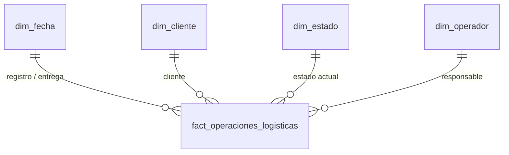

# DataMart — Diseño dimensional (metodología Kimball)

Este documento describe el componente analítico implementado, verificado contra
`backend/database/scripts/01_schema_completo.sql`, `07_muestra_investigacion.sql` y
`backend/src/datamart/etl.service.js`.

La tesis utiliza **aplicación web + DataMart** como una única solución tecnológica integrada.
Scrum y Kimball son metodologías complementarias, no dos proyectos independientes.

---

## 1. Relación Scrum – Kimball

| Metodología | Rol en la solución |
|---|---|
| **Scrum** | Organizó iterativamente el desarrollo funcional de la aplicación web |
| **Kimball** | Organizó el diseño y la construcción del componente analítico y del DataMart |

La integración funcional ocurrió en el **Sprint 5**, historia **H.U.18 – Análisis de operaciones**.
Scrum no describe el grano, las dimensiones ni el ETL; esos aspectos corresponden a Kimball.
No existe un Sprint 6 de DataMart.

---

## 2. Propósito y alcance

El DataMart corresponde únicamente al **área de operaciones**.

**Proceso de negocio:** gestión de operaciones logísticas de envíos.

No constituye un Data Warehouse corporativo. El modelo operacional y el modelo dimensional
conviven como **dos modelos lógicos dentro de una única base de datos física MySQL**
denominada `trazabilidad_logistica`.

El objetivo analítico es consolidar operaciones de envío para consultar tiempo de tránsito,
cumplimiento de entregas, incidencias, retrasos y peso transportado, según fecha, cliente,
estado y operador.

---

## 3. Indicadores de investigación ≠ métricas del DataMart

Los indicadores estadísticos de la tesis **no** son métricas del esquema estrella.

| Tipo | Indicador | Finalidad |
|---|---|---|
| Investigación | **TPDRE** — Tiempo promedio diario de registro de envíos | Operacionalización de la eficiencia operativa |
| Investigación | **PDRE** — Porcentaje diario de registros con error | Calidad de la información logística |
| Investigación | **PDEEA** — Porcentaje diario de envíos con estado actualizado | Control y seguimiento |
| Investigación | **PDIOIC** — Porcentaje diario de incidencias operativas con información completa | Gestión de la información operativa |
| DataMart | `peso_kg` | Peso transportado |
| DataMart | `dias_transito` | Duración del tránsito |
| DataMart | `cantidad_incidencias` | Incidencias por operación |
| DataMart | `tuvo_retraso` | Operaciones con incidencia de retraso |
| DataMart | `entregado_a_tiempo` | Cumplimiento de la fecha estimada |

La unidad de análisis de la investigación es la **jornada operativa**. El grano del DataMart es
la **operación de envío**. Son conceptos distintos.

Kimball no desarrolla preprueba ni posprueba como funcionalidad del producto.

---

## 4. Declaración del grano

> **Una fila de `fact_operaciones_logisticas` representa una operación de envío.**

Identificador: `id_envio`.

- El ETL inserta como máximo una fila por envío (`NOT EXISTS` + `UNIQUE(id_envio)`).
- Las reejecuciones actualizan las métricas de la fila existente.
- **No** hay una fila por jornada, por estado, por incidencia ni snapshots periódicos.

---

## 5. Dimensiones

Únicamente:

| Dimensión | Clave subrogada | Clave natural | SCD implementado | Atributos |
|---|---|---|---|---|
| `dim_fecha` | `id_fecha` (AAAAMMDD) | `fecha` | **Tipo 0** (estática, precargada) | `anio`, `trimestre`, `mes`, `nombre_mes`, `dia`, `dia_semana`, `nombre_dia`, `es_fin_semana`, `semana_anio` |
| `dim_cliente` | `id_dim_cliente` | `id_cliente_origen` | **Tipo 1** | `razon_social`, `ruc`, `ciudad`, `distrito`, `segmento` |
| `dim_estado` | `id_dim_estado` | `id_estado_origen` | **Tipo 1** | `codigo`, `nombre`, `es_final`, `categoria` |
| `dim_operador` | `id_dim_operador` | `id_usuario_origen` | **Tipo 1** | `nombre_completo`, `rol` |

`dim_fecha` es además dimensión *role-playing*: `id_fecha_registro` e `id_fecha_entrega`.

Para `dim_cliente`, `dim_estado` y `dim_operador`, los cambios descriptivos se **sobrescriben** (Tipo 1).
No se implementa SCD Tipo 2 completo.

Cuando un miembro deja de estar activo en la fuente operacional, el ETL puede marcar
`es_actual = 0` y `vigente_hasta = CURDATE()`. Eso distingue miembros no vigentes; **no** convierte
el modelo en Tipo 2.

**No existe `dim_ruta`.** `origen` y `destino` permanecen en el modelo operacional `envios` porque
no hay un requerimiento analítico que justifique una dimensión independiente.

---

## 6. Tabla de hechos

`fact_operaciones_logisticas`

| Campo | Rol |
|---|---|
| `id_fact` | Clave subrogada del hecho |
| `id_envio` | Identificador de la operación (unicidad del grano) |
| `id_fecha_registro` | FK a `dim_fecha` (role-playing) |
| `id_fecha_entrega` | FK a `dim_fecha` (role-playing, nullable) |
| `id_dim_cliente` | FK a `dim_cliente` |
| `id_dim_estado` | FK a `dim_estado` |
| `id_dim_operador` | FK a `dim_operador` (nullable) |
| `codigo_envio` | **Dimensión degenerada** |
| `peso_kg` | Métrica aditiva |
| `tipo_carga` | Atributo degenerado / descriptivo |
| `dias_transito` | Métrica semiaditiva (`NULL` si no hay entrega) |
| `cantidad_incidencias` | Métrica aditiva |
| `tuvo_retraso` | Bandera (incidencia tipo retraso) |
| `entregado_a_tiempo` | Bandera (`NULL` si faltan fechas) |
| `fecha_carga` | Control de carga |
| `origen_dato` | Control (`REAL` \| `SINTETICO`) |



---

## 7. Requerimientos analíticos

| Código | Requerimiento | Métrica |
|---|---|---|
| RA01 | Cumplimiento de entregas en plazo | `entregado_a_tiempo` |
| RA02 | Duración de las operaciones | `dias_transito` |
| RA03 | Incidencias por operación | `cantidad_incidencias` |
| RA04 | Operaciones con retraso | `tuvo_retraso` |
| RA05 | Peso transportado | `peso_kg` |
| RA06 | Análisis por fecha, cliente, estado y operador | claves dimensionales |

Consultas: `GET /api/datamart/analytics` y módulo Análisis de operaciones de la aplicación web.

---

## 8. Fuentes y ETL

Implementado en `backend/src/datamart/etl.service.js`.

**Fuentes:** `envios`, `clientes`, `estados_envio`, `usuarios`, `roles`, `incidencias`.

```
modelo operacional
  → extracción
  → transformación
  → carga de dimensiones
  → carga / actualización de hechos
  → bitácora de ejecución
  → DataMart
```

### Staging

El proyecto **no** utiliza tablas físicas de staging (`stg_*` no existen). Las transformaciones
se realizan desde las tablas operacionales hacia el modelo dimensional. El método `runStaging()`
conserva ese nombre por compatibilidad técnica; no representa una zona física de staging.

### Idempotencia

Reejecutar el ETL **no duplica** una operación en la tabla de hechos:

1. `NOT EXISTS` sobre `fact_operaciones_logisticas.id_envio` en el `INSERT`.
2. `UNIQUE(id_envio)`.
3. Comprobación de claves naturales de dimensiones (`NOT EXISTS` + `es_actual = 1`).
4. Actualización de hechos ya cargados.
5. Transacción única con `commit` / `rollback`.

Cubierto por `backend/tests/etl.service.test.js`.

### Bitácora

Tabla `etl_ejecuciones`:

| Campo | Contenido |
|---|---|
| `id_ejecucion` | Identificador |
| `proceso` | Nombre del proceso |
| `fecha_inicio` / `fecha_fin` | Marca temporal |
| `estado` | `EN_PROCESO` \| `EXITOSO` \| `FALLIDO` |
| `registros_extraidos` | Filas leídas |
| `registros_transformados` | Filas que superaron validaciones |
| `registros_cargados` | Hechos insertados |
| `mensaje_error` | Detalle del fallo, si lo hubo |
| `created_at` | Alta del registro |

Consultable en `GET /api/datamart/etl/ejecuciones`. Si la tabla aún no existe, el ETL termina y
devuelve `idEjecucion: null`.

---

## 9. Datos sintéticos

Los datos sintéticos se usan **solo** para:

- pruebas técnicas del ETL
- pruebas de volumen
- demostración del esquema estrella
- consultas analíticas
- validación del DataMart

Quedan marcados `origen_dato = 'SINTETICO'` y `grupo_muestra = 'NO_MUESTRA'`.
**No fueron proporcionados por la empresa** y **no participan** en los indicadores de investigación
(TPDRE, PDRE, PDEEA, PDIOIC).

---

## 10. Explotación analítica

El DataMart se consume desde el módulo **Análisis de operaciones** (H.U.18) de la aplicación web,
mediante `/api/datamart`.

```
Aplicación web
  → modelo operacional
  → ETL
  → DataMart
  → API /api/datamart
  → módulo Análisis de operaciones
```

La interfaz (`/datamart`) consulta hechos, dimensiones, KPIs analíticos y la bitácora del ETL.
No forma parte de la solución tecnológica una herramienta BI externa.

---

## 11. Validaciones

| Validación | Mecanismo |
|---|---|
| Envío sin `fecha_registro` | no entra a hechos |
| Envío sin cliente o estado resoluble | `JOIN` obligatorio |
| Operador ausente | `LEFT JOIN` → `id_dim_operador` nulo |
| Peso o tipo de carga nulos | `COALESCE` |
| Duplicación de hechos | `NOT EXISTS` + `UNIQUE(id_envio)` |
| Duplicación de dimensiones | `NOT EXISTS` sobre clave natural + `es_actual = 1` |
| Fallo parcial | transacción con `rollback` |
